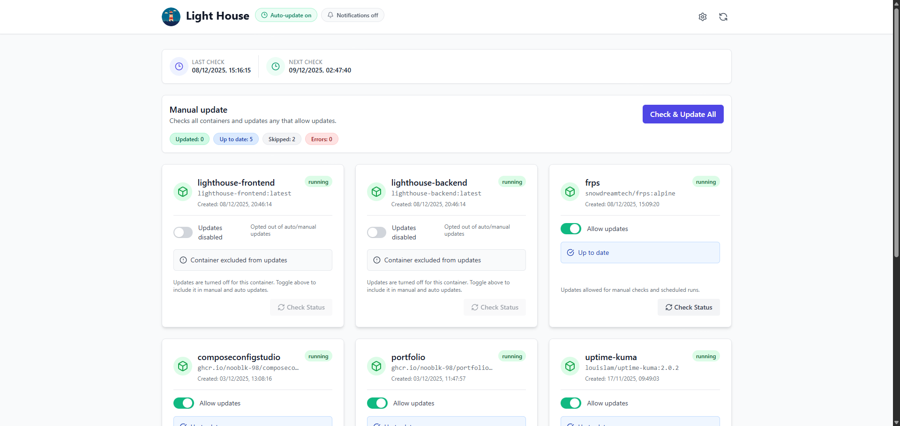

<div align="center">
  

  # Lighthouse

  A process for automating Docker container base image updates (alternative to watchtower).

  <div>
    <a href="https://hub.docker.com/r/lahiru98s/lighthouse-ui"></a>
    <a href="https://github.com/nooblk-98/lighthouse/releases"></a>
    <a href="https://github.com/nooblk-98/lighthouse/actions/workflows/docker-build-push.yml"></a>
     <a href="https://creativecommons.org/licenses/by-nc/2.0/">
    
  </div>
</div>

---

## Features

- **Real-time Container Monitoring** - View live container stats and status
- **Manual & Auto Updates** - Check/update containers and skip exclusions
- **Email Notifications** - Optional SMTP alerts after updates
- **Multi-architecture Support** - `linux/amd64`, `linux/arm64`, `linux/arm/v7`
- **Modern Web UI** - React + Tailwind
- **RESTful API** - Python backend
- **Docker Compose Ready** - Quick setup with docker-compose

## Quick Start

### Prerequisites
- Docker & Docker Compose (v3.8+)
- Port 8066 (frontend) and 8000 (backend) available

### Installation

Run using pre-built images
   ```bash
   docker-compose -f docker-compose.production.yml up -d
   ```


## Docker Compose (pre-built images)

Use `docker-compose.production.yml` to run the published images without building:

```yaml
services:
  lighthouse:
    image: lahiru98s/lighthouse:latest
    container_name: lighthouse
    ports:
      - "8066:80"
    volumes:
      - /var/run/docker.sock:/var/run/docker.sock
      - ./settings.json:/app/settings.json
    restart: always
    networks:
      - lighthouse-net

networks:
  lighthouse-net:
    driver: bridge
```

## Using Pre-built Images

Instead of building locally, pull the published images:

```bash
# Docker Hub
docker pull lahiru98s/lighthouse:latest

# GitHub Container Registry
docker pull ghcr.io/nooblk-98/lighthouse:latest
```

Run with compose:
```bash
docker-compose -f docker-compose.production.yml up -d
```

Run FrontEnd with remote Backend For developement 
```bash
$env:VITE_API_PROXY_TARGET="http://80.225.221.245:8000"; npm run dev
```
Dev with compose:
```bash
docker compose build --no-cache && docker compose up
```

## UI Preview

<div align="center">
  
  <br/><br/>
  
</div>

## Development

### Run locally without Docker

**Backend**
```bash
cd server
pip install -r requirements.txt
python main.py
```

**Frontend**
```bash
cd client
npm install
npm run dev
```

### Build images locally
```bash
docker-compose build
```

### View logs
```bash
docker-compose logs -f backend
docker-compose logs -f frontend
```

Contributions welcome

## TODO / Ideas
- Create login page for UI
- ~~Support custom registry credentials~~
- Improve scheduler UI: show detailed history and allow pause/resume.
- Add image cleanup after updates (configurable retention).
